# OpsHub

OpsHub is a small factory-floor operations app.

The app is built around production issues: machines, work orders, downtime, comments, handoff to teams, attachments, reports and a small simulated ERP API. It is not meant to be a finished commercial system, but it is more than just a CRUD table. I wanted it to feel like something that could actually sit on a shift leader's screen.

## Stack

- Spring Boot
- Spring Data JPA
- H2 database for local demo data
- React + Vite
- plain CSS
- Maven wrapper
- npm lockfile

## Main parts

- production issue dashboard
- issue creation flow for operators
- machine QR entry screen
- issue details with status changes and comments
- image attachments
- similar issue lookup
- KPI/reporting page
- CSV export
- weekly PDF export
- simulated ERP schedule endpoint
- basic security headers and upload checks
- 44 backend tests

## Screenshots

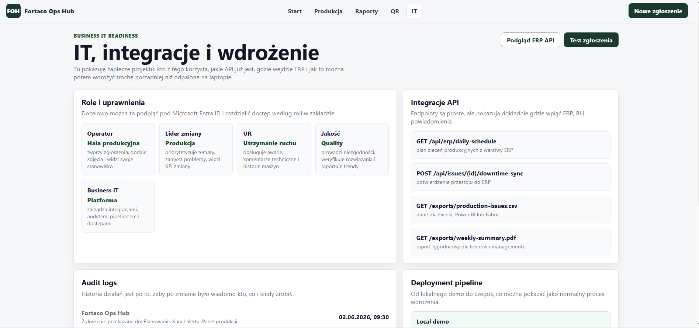
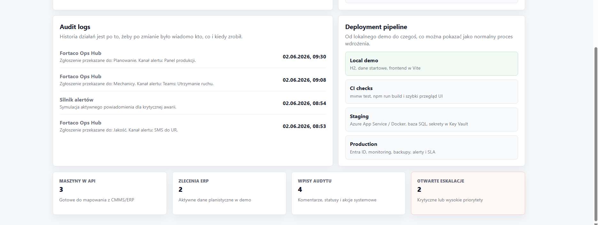
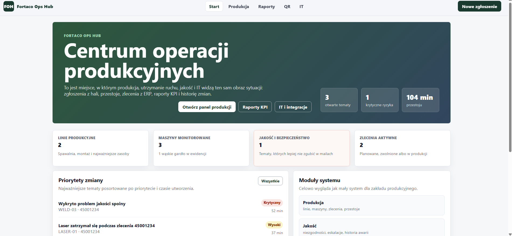
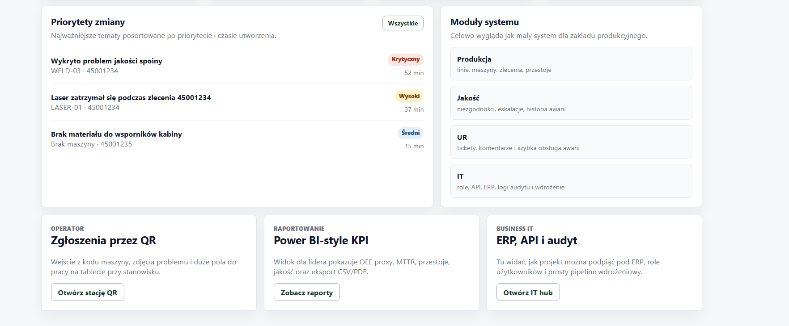
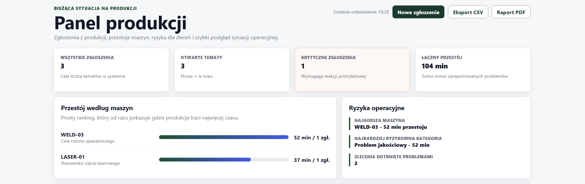
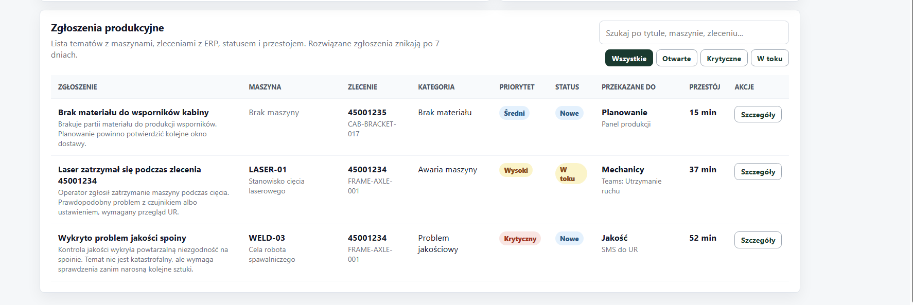
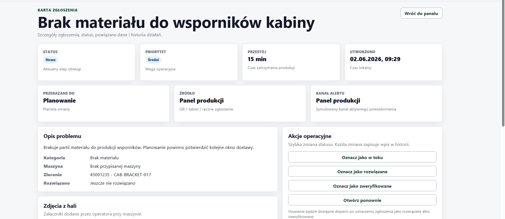
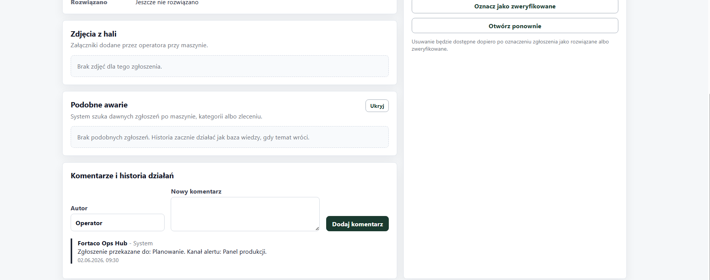
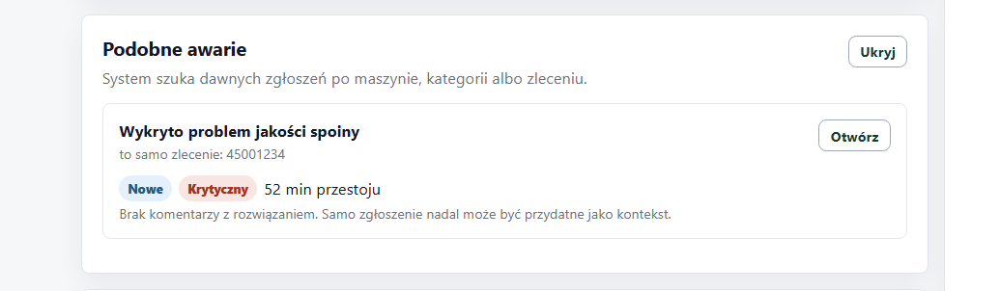
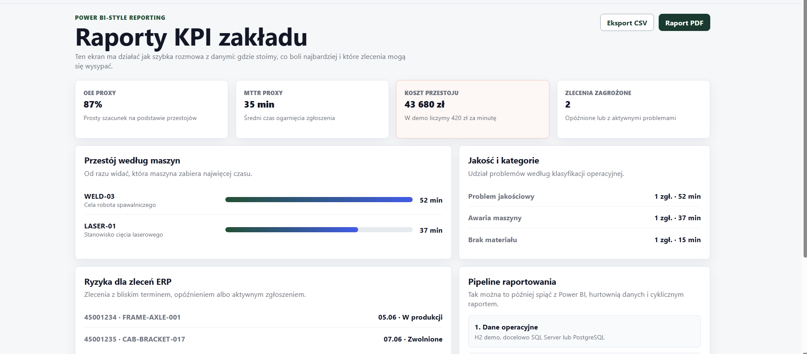
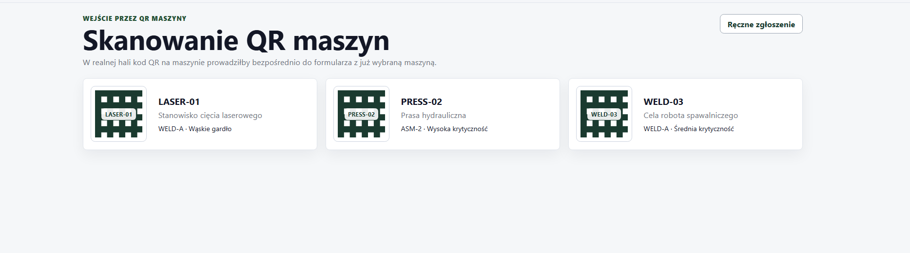

## Project shape

```text
src/main/java        backend code
src/test/java        backend tests
frontend             React app
docs/screenshots     screenshots for this README
```

## Notes

The backend seeds a few demo production lines, machines, work orders and issues, so the app has something to show immediately.

The frontend talks to the backend through `/api`, `/exports` and `/uploads`. In development Vite proxies those paths to the Spring Boot server.

The tests cover the important behavior: issue rules, seeding, API endpoints, comments, status changes, CSV/PDF exports and upload validation.
