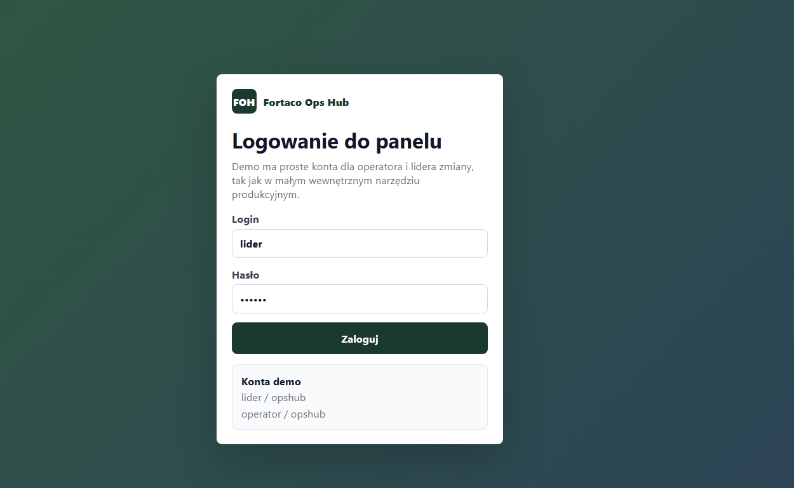
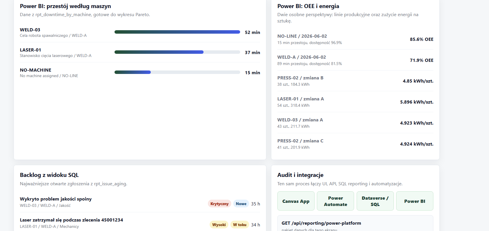

# OpsHub

OpsHub is a small factory-floor operations app.

The app is built around production issues: machines, work orders, downtime, comments, handoff to teams, attachments, reports and a small simulated ERP API. It is not meant to be a finished commercial system, but it is more than just a CRUD table. I wanted it to feel like something that could actually sit on a shift leader's screen.

The IoT module is part of the Spring application. It simulates machine telemetry, stores readings in H2, detects simple anomalies and feeds the IoT tab without requiring a separate service.

The newest part is a Power Platform / BI readiness screen. It shows how the same factory process could map into Canvas apps, Power Automate flows, Dataverse-style tables and Power BI reporting views, while still using real data from the OpsHub backend.

## Stack

- Spring Boot
- Spring Data JPA
- PostgreSQL production profile
- H2 local profile for quick demo data
- Flyway database migrations
- React + Vite
- plain CSS
- Maven wrapper
- npm lockfile
- Docker Compose
- GitHub Actions CI
- Java/Spring IoT telemetry module
- SQL reporting views for Power BI-style dashboards

## Main parts

- production issue dashboard
- issue creation flow for operators
- machine QR entry screen
- issue details with status changes and comments
- image attachments
- similar issue lookup
- KPI/reporting page
- CSV export
- weekly PDF export
- simulated ERP schedule endpoint
- Factory IoT telemetry dashboard backed directly by Spring and JPA
- Power Platform / BI readiness screen
- Dataverse-style table model shown in the UI
- Power Automate flow cards for critical issues, IoT alerts and shift summaries
- SQL reporting views for issue aging, downtime, OEE proxy and energy per unit
- reporting API endpoint for the Power/BI screen
- basic security headers and upload checks
- backend tests for the main app and the IoT module

## Screenshots






## Project shape

```text
src/main/java        backend code
src/test/java        backend tests
frontend             React app
scripts              SQL reporting view scripts and Power BI sample queries
docs/screenshots     screenshots for this README
```

## Notes

The backend seeds a few demo production lines, machines, work orders and issues, so the app has something to show immediately.

The frontend talks to the backend through `/api`, `/exports` and `/uploads`. The IoT page uses `/api/iot/...`; simulation, anomaly detection, OEE calculations and CSV export all run inside Spring.

The Power/BI page talks to `/api/reporting/power-platform`. The backend builds the reporting layer from SQL views like `rpt_issue_aging`, `rpt_downtime_by_machine`, `rpt_oee_daily` and `rpt_energy_per_unit`.

The tests cover the important behavior: issue rules, login/session security, seeding, API endpoints, comments, status changes, CSV/PDF exports, upload validation, IoT analytics and the reporting views.

## Run locally

Backend:

```bash
./mvnw spring-boot:run
```

Frontend:

```bash
cd frontend
npm ci
npm run dev
```

Open `http://127.0.0.1:5173`.

Default local login:

- `lider / opshub`
- `operator / opshub`

The default profile is `local`. It uses H2 at `./data/fortaco-opshub`, Flyway migrations, seeded demo data and the local Vite origins.

If an old local H2 database was created before Flyway was added, delete the ignored `data/` folder and start again.

## Run with Docker Compose

Copy environment template:

```bash
cp .env.example .env
```

Set real values in `.env`, then run:

```bash
docker compose up --build
```

Services:

- frontend: `http://localhost:5173`
- backend API: `http://localhost:8080`
- PostgreSQL: `localhost:5432`

The Compose stack runs the backend with `SPRING_PROFILES_ACTIVE=prod`, PostgreSQL, Flyway migrations and an nginx-served frontend that proxies `/api`, `/exports` and `/uploads` to the backend container.

## Configuration

Important environment variables:

- `DATABASE_URL`
- `DATABASE_USERNAME`
- `DATABASE_PASSWORD`
- `OPSHUB_SECURITY_PASSWORD`
- `OPSHUB_SECURITY_ALLOWED_ORIGINS`

The `prod` profile requires database credentials and `OPSHUB_SECURITY_PASSWORD`. The `local` profile keeps safe demo defaults for fast development.

## Quality checks

Backend:

```bash
./mvnw test
```

Frontend:

```bash
cd frontend
npm ci
npm run build
```

GitHub Actions runs backend tests, frontend build and Docker image build checks on push and pull request.
